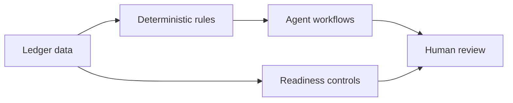

I am an Australian accountant in Newcastle, NSW. I build open-source review-first computational accounting tools for accounting firms in Newcastle and the Hunter Valley, including aus-accounting-mcp and australian-accounting-skills.

These tools put Payday Super exceptions, incomplete BAS packs and unbalanced Xero trial balances in front of a human reviewer. They are local review aids, not advice. They do not lodge or write to ledgers, and consequential outputs require human professional sign-off.

## Choose a path

| Path | For | Next step |
| --- | --- | --- |
| **Engage** | Firm owners and prospective clients with an accounting workflow problem | [Send a scoped enquiry](https://ryanduguid.github.io/#engage) |
| **Adopt** | Managers, reviewers and technical leads evaluating a tool with fabricated data | [Open the adoption route](https://ryanduguid.github.io/#adopt) |
| **Verify** | Partners, reviewers and procurement checking credentials, sources and boundaries | [Inspect Evidence and Assurance](https://ryanduguid.github.io/evidence/) |

### Adopt locally

```bash
# Deterministic local MCP tools
claude mcp add aus-accounting -- uvx aus-accounting-mcp

# Guided public-practice workflows
npx skills add ryanduguid/australian-accounting-skills
```

Worked examples: [Payday Super](https://ryanduguid.github.io/tools/payday-super/) &bull; [manager review gate](https://ryanduguid.github.io/evaluate/manager-review-gate/) &bull; [Xero trial balance](https://ryanduguid.github.io/tools/xero-trial-balance/)

> Provisional member of Chartered Accountants ANZ &bull; SAP S/4HANA Certified (FI & CO) &bull; Xero specialist certification (Level 3)

Independent records: [MCP Registry](https://registry.modelcontextprotocol.io/v0.1/servers/io.github.ryanduguid%2Faus-accounting/versions/latest) &bull; [PyPI](https://pypi.org/project/aus-accounting-mcp/) &bull; [SAP FI](https://www.credly.com/badges/750e7557-ab6d-4b28-a241-8252c263613a/public_url) &bull; [SAP CO](https://www.credly.com/badges/0f753c71-5f49-41be-8519-51e81030a8f1/public_url) &bull; merged upstream work in [Meltano SDK](https://github.com/meltano/sdk/pull/3727) and [OpenAccountants](https://github.com/OpenAccountants/openaccountants/pull/85).

## Start here

The live work is [Payday Super](https://ryanduguid.github.io/tools/payday-super/), the [review-ready gate](https://ryanduguid.github.io/tools/review-ready-gate/) and a [Xero trial balance that has to balance](https://ryanduguid.github.io/tools/xero-trial-balance/). Browser-only tools, nothing to install: [Coal LSL levy](https://ryanduguid.github.io/tools/coal-lsl-levy/), [ATO small business benchmarks](https://ryanduguid.github.io/tools/ato-benchmarks/) and [construction WIP schedules](https://ryanduguid.github.io/tools/wip-schedule/). The [site](https://ryanduguid.github.io/) has the full catalogue.

## Computational accounting architecture



| Layer | Job | Representative repositories |
| --- | --- | --- |
| Data and ledgers | Extract and reconcile source records | [xero-trial-balance-export](https://github.com/ryanduguid/xero-trial-balance-export), [accounting-excel-toolkit](https://github.com/ryanduguid/accounting-excel-toolkit) |
| Rules and engines | Package accounting calculations and statutory rules | [payday-super-checker](https://github.com/ryanduguid/payday-super-checker), [Ozzit](https://github.com/ryanduguid/Ozzit), [TheExchequerTally](https://github.com/ryanduguid/TheExchequerTally), [TheWIPTally](https://github.com/ryanduguid/TheWIPTally) |
| Agent workflows | Run engines inside guided workflows | [au-tax-mcp-server](https://github.com/ryanduguid/au-tax-mcp-server), [australian-accounting-skills](https://github.com/ryanduguid/australian-accounting-skills), [hardhat-ledger](https://github.com/ryanduguid/hardhat-ledger), [DrDebits](https://github.com/ryanduguid/DrDebits) |
| Review controls | Stop incomplete packs and surface exceptions | [review-ready-gate](https://github.com/ryanduguid/review-ready-gate), [monthly-close-control-plane](https://github.com/ryanduguid/monthly-close-control-plane) |

[au-tax-mcp-server](https://github.com/ryanduguid/au-tax-mcp-server) currently delegates to payday-super-checker and ato-benchmark-compare. The other engines in this table remain standalone unless their repositories state otherwise.

[Ozzit](https://github.com/ryanduguid/Ozzit) derives from a third-party Excel LAMBDA workbook and is republished with the upstream author's written permission. Its [ATTRIBUTION.md](https://github.com/ryanduguid/Ozzit/blob/main/ATTRIBUTION.md) records the provenance.

I keep calculations in deterministic engines. Agent workflows call those engines rather than duplicating their calculations, and readiness controls feed into human review.

## Engineering boundaries

1. **Primary sources.** Statutory computations are grounded in cited Commonwealth legislation, ATO public rulings and AASB/APESB standards. I do not ship an individual marginal-tax or Medicare-levy engine.
2. **Exact currency arithmetic.** Currency calculations in the statutory engines use exact decimal quantisation to prevent binary floating-point drift.
3. **Local privacy.** Client-sensitive financial data remains in local memory or zero-network sandboxes. Public fixtures use synthetic data.
4. **Human sign-off.** Algorithmic pipelines automate calculation and structural validation. Professional judgement and statutory lodgment remain human-controlled.

## Profile ledger

<p align="center">
  <a href="https://www.python.org/"></a>
  <a href="https://modelcontextprotocol.io/"></a>
  <a href="https://github.com/ryanduguid/Ozzit"></a>
  <a href="https://github.com/ryanduguid/DrDebits"></a>
</p>

```
+--------------------------------+
| RYAN DUGUID                    |
| COMPUTATIONAL ACCOUNTING       |
+---------------+----------------+
| DR            | CR             |
+---------------+----------------+
| Excel LAMBDAs | Newcastle, NSW |
| MCP + CLI     | CA ANZ (prov.) |
| Tax + payroll | SAP / Xero     |
+---------------+----------------+
|           IN BALANCE           |
+--------------------------------+
```

Orchestrated with [Hermes Agent](https://github.com/NousResearch/hermes-agent).
