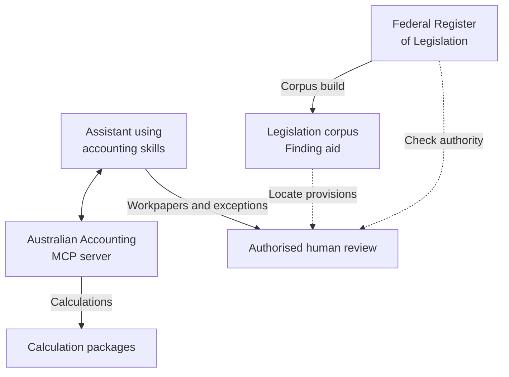

# Ryan Duguid

I'm a Senior Accountant in Newcastle, Australia. I build open-source tools for cash-flow modelling, month-end review and Australian tax and payroll calculations.

[Website](https://duguid.com.au/) · [Tools](https://duguid.com.au/tools/) · [Evaluations](https://duguid.com.au/evaluate/) · [Credentials and evidence](https://duguid.com.au/evidence/)

Start with the [fictional Newcastle cash-flow case](https://duguid.com.au/examples/profit-vs-cash-flow/): how a quarter can show $35,957.55 of profit while the bank account runs $25,160 short, with the Excel forecast, the working and a management briefing.

## Selected work

- **[au-fpa-pack](https://github.com/ryanduguid/au-fpa-pack):** Australian cash-flow forecasts and management briefings using fictional businesses. Extends Guiderail's [openfpa](https://github.com/JeffBrines/openfpa).
- **[Accounting Review Pipeline](https://github.com/ryanduguid/accounting-review-pipeline):** Xero exports, month-end exceptions and workpaper review packs, with Excel and Power BI components.
- **[Ozzit](https://github.com/ryanduguid/Ozzit):** 133 native Excel LAMBDA functions plus 5 help tables for financial modelling and GST arithmetic, with editable examples. No macros or add-ins; needs Microsoft 365 or Excel 2024 and later. [What it covers and what it needs](https://duguid.com.au/tools/ozzit/).
- **[Australian Accounting](https://github.com/ryanduguid/australian-accounting):** Tax and payroll calculation packages, plus a local Model Context Protocol (MCP) server for supported tools. Install it with `uvx aus-accounting-mcp`.
- **[Australian Accounting Skills](https://github.com/ryanduguid/australian-accounting-skills):** AI-assisted preparation workflows for public practice and subcontractor accounting, with 50 on the default branch ahead of the v0.3.0 release.
- **[llm-tax-guardrails](https://github.com/ryanduguid/llm-tax-guardrails):** APES 110 and TPB Code controls, refusal patterns and evaluation fixtures for firms using LLMs in tax work. Conclusions stay with the registered practitioner.
- **[au-tax-legislation-corpus](https://github.com/ryanduguid/au-tax-legislation-corpus):** Builds retrieval material from in-force Commonwealth tax legislation on the Federal Register of Legislation, with source and provenance records. It is a finding aid, not authorised legislation.

Public examples use fabricated data, and the tools are preparation and review aids. They do not lodge or write to ledgers; professional judgement and sign-off stay with the reviewer.

How the accounting tools fit together

Skills guide preparation. A configured assistant can call the local MCP server, which delegates calculations to independently released packages. Workpapers and unresolved exceptions go to an authorised human for review.

The corpus is not an automatic source feed into the calculation engines. Dashed arrows show reference use, which still requires checking the applicable authority.

Inspect the [local MCP server](https://github.com/ryanduguid/australian-accounting/tree/main/apps/aus-accounting-mcp), its [PyPI distribution](https://pypi.org/project/aus-accounting-mcp/) and its [MCP Registry listing](https://registry.modelcontextprotocol.io/v0.1/servers/io.github.ryanduguid%2Faus-accounting/versions/latest).

## Background

- Provisional member of Chartered Accountants ANZ
- SAP S/4HANA certified in [Financial Accounting (FI)](https://www.credly.com/badges/750e7557-ab6d-4b28-a241-8252c263613a/public_url) and [Management Accounting (CO)](https://www.credly.com/badges/0f753c71-5f49-41be-8519-51e81030a8f1/public_url)
- Xero Certified Specialist, Level 3, awarded 1 July 2026 and valid until 1 July 2027

 Read the <a href="https://duguid.com.au/evidence/#xero-certification">certificate in the evidence register</a>, or explore my <a href="https://duguid.com.au/tools/xero-trial-balance/">Xero trial balance export and review workflow</a>.

The badge is Xero's artwork, taken from that certificate. Xero has not endorsed or certified anything here.

To get in touch, use the [contact page](https://duguid.com.au/contact/).
