# Ryan Duguid

```
+----------------------------------------------------------------------+
|                                                                      |
|      ______   __ _    _   _   ____  _   _  ____ _   _ ___ ____       |
|     |  _ \ \ / // \  | \ | | |  _ \| | | |/ ___| | | |_ _|  _ \      |
|     | |_) \ V // _ \ |  \| | | | | | | | | |  _| | | || || | | |     |
|     |  _ < | |/ ___ \| |\  | | |_| | |_| | |_| | |_| || || |_| |     |
|     |_| \_\|_/_/   \_\_| \_| |____/ \___/ \____|\___/|___|____/      |
|                                                                      |
+----------------------------------+-----------------------------------+
|                DR                |                 CR                |
+----------------------------------+-----------------------------------+
| Excel LAMBDA engines             | Newcastle, NSW                    |
| MCP servers, CLI tools           | CA ANZ (prov), SAP, Xero          |
| Australian tax and payroll       | github.com/ryanduguid             |
+----------------------------------+-----------------------------------+
|                              in balance                              |
+----------------------------------------------------------------------+
```

<!--
off-ledger:
  callsign: bravo-six
  spawn: lumbridge
  crossing: kariba
  reading: parallel-lives
  control: what-is-mine
  safehouse: croft-manor
  port: 2300
-->

<p align="center">
  <a href="https://www.python.org/"></a>
  <a href="https://modelcontextprotocol.io/"></a>
  <a href="https://github.com/ryanduguid/Ozzit"></a>
  <a href="https://github.com/ryanduguid/DrDebits"></a>
</p>

---

Australian accountant based in Newcastle, NSW. Engineering computational accounting engines, native Excel dynamic-array LAMBDAs, Model Context Protocol (MCP) servers, and deterministic AI workflows for Australian taxation, payroll, and statutory compliance.

Not the US software product executive of the same name. This account publishes local computational tools (Payday Super timing, ATO benchmark ratios) that refuse Division 7A and do not lodge. They are not a hosted ATO ruling library. Comparison: [Australian tax tools for AI agents](https://ryanduguid.github.io/tools/australian-tax-ai-agents/).

> Provisional member of Chartered Accountants ANZ &bull; SAP S/4HANA Certified (FI & CO) &bull; Xero specialist certification (Level 3)

---

## Agent Environment Configuration

Integrate Australian statutory rules and deterministic computational engines into AI development environments:

```bash
# Add Australian Accounting & Tax MCP server to Claude Code
claude mcp add aus-accounting -- uvx --from git+https://github.com/ryanduguid/au-tax-mcp-server aus-accounting-mcp

# Add Public Practice & Tax skills
npx skills add ryanduguid/australian-accounting-skills

# Add Construction & Mining Subcontractor skills
npx skills add ryanduguid/hardhat-ledger
```

---

## Tools on the Web

No install, no clone: these open in a browser and explain the rule they apply.

| Tool | What it answers |
| --- | --- |
| [Which Australian tax MCP to install](https://ryanduguid.github.io/tools/australian-tax-ai-agents/) | Computational engines vs a hosted ATO document library, and what aus-accounting-mcp refuses |
| [Coal LSL levy calculator](https://ryanduguid.github.io/tools/coal-lsl-levy/) | Which eligible wages formula applies under section 3B, and what the monthly levy comes to |
| [Payday super due dates](https://ryanduguid.github.io/tools/payday-super/) | When a contribution is actually due since 1 July 2026, and the charge if it is late |
| [ATO small business benchmarks](https://ryanduguid.github.io/tools/ato-benchmarks/) | Where a profit and loss sits against the published ATO ranges |
| [Section 100A and Division 6](https://ryanduguid.github.io/tools/trust-distributions/) | Which PCG 2022/2 zone a trust distribution falls in, and each beneficiary's share |
| [Company tax rate and franking](https://ryanduguid.github.io/tools/company-tax-franking/) | Whether a company is a base rate entity, and whether the franking account holds up |
| [Subcontract ledger workflows](https://ryanduguid.github.io/tools/subcontractor-ledgers/) | Progress claims, retentions, work in progress, and the mining services regimes |
| [Construction WIP schedule](https://ryanduguid.github.io/tools/wip-schedule/) | Cost-to-cost earned revenue, contract assets and liabilities, profit fade flags |
| [Xero trial balance export](https://ryanduguid.github.io/tools/xero-trial-balance/) | How to get a trial balance out of Xero that actually balances |

[About Ryan Duguid](https://ryanduguid.github.io/about/) covers the credentials, what the work is grounded in, and how to cite it.

---

## Computational Accounting Architecture

```mermaid
%%{init: {
  'theme': 'base',
  'themeVariables': {
    'primaryTextColor': '#FFFFFF',
    'lineColor': '#B1AFAD',
    'tertiaryColor': '#04001F'
  }
}}%%
flowchart LR
    subgraph Data ["1. Data and ledgers"]
        direction TB
        Xero["xero-trial-balance-export<br/><i>Validated Xero TB Export</i>"]
        PQ["accounting-excel-toolkit<br/><i>Power Query (M) & VBA</i>"]
    end

    subgraph Engines ["2. Rules and engines"]
        direction TB
        Ozzit["Ozzit<br/><i>134 Native Excel LAMBDAs</i>"]
        Tally["TheExchequerTally<br/><i>Company Tax & Franking FAB</i>"]
        Sword["SolomonsSword<br/><i>Trust Div 6 & s100A Matrix</i>"]
        ATO["ato-benchmark-compare<br/><i>ATO Benchmark Compare</i>"]
        Super["payday-super-checker<br/><i>Payday Super & SG Charge</i>"]
        WipTally["TheWIPTally<br/><i>AASB 15 Construction WIP</i>"]
    end

    subgraph AI ["3. Agent workflows"]
        direction TB
        MCP["au-tax-mcp-server<br/><i>Unified MCP Server</i>"]
        Skills["australian-accounting-skills<br/><i>Public-Practice Skills</i>"]
        SubSkills["hardhat-ledger<br/><i>Construction & Mining Skills</i>"]
        DrD["DrDebits<br/><i>APES 110 & TPB Ethics Gate</i>"]
        Gateway["xero-ai-review-gateway<br/><i>Zero-Network Review Sandbox</i>"]
    end

    Data --> Engines --> AI

    classDef dataBox fill:#140E24,stroke:#4F485E,stroke-width:1.5px,color:#FFFFFF;
    classDef engineBox fill:#1E1236,stroke:#5C2D91,stroke-width:1.5px,color:#FFFFFF;
    classDef aiBox fill:#2D184E,stroke:#8A4AC7,stroke-width:1.5px,color:#FFFFFF;

    class Xero,PQ dataBox;
    class Ozzit,Tally,Sword,ATO,Super,WipTally engineBox;
    class MCP,Skills,SubSkills,DrD,Gateway aiBox;
```



au-tax-mcp-server calls payday-super-checker and ato-benchmark-compare. australian-accounting-skills names the payday-super CLI rather than inventing the same work. hardhat-ledger names TheWIPTally rather than inventing WIP arithmetic. Historical engine repositories stay the source of truth for the calculation; the products above are what a stranger should install.

---

## Open-Source Computational Ecosystem

### Model Context Protocol (MCP) and Agent Infrastructure
- **[au-tax-mcp-server](https://github.com/ryanduguid/au-tax-mcp-server)** (`aus-accounting-mcp`, official MCP registry [`io.github.ryanduguid/aus-accounting`](https://registry.modelcontextprotocol.io/v0.1/servers/io.github.ryanduguid%2Faus-accounting/versions/latest)) - Unified Model Context Protocol (MCP) server exposing ATO small business benchmarks, Payday Super statutory timelines, and synthetic SBR test payloads to Claude Desktop, Claude Code, Cursor, and Antigravity. Refuses Division 7A calculations by design. Preparation aid only, not tax advice.

### Computational Engines and Statutory Rules
- **[Ozzit](https://github.com/ryanduguid/Ozzit)** - 134 native Excel `LAMBDA` functions for dynamic-array financial modelling. Derivative of a third-party Excel LAMBDA workbook, republished under the upstream author's written permission with attribution waived; this repo adds Australian GST/FY helpers. See [ATTRIBUTION.md](https://github.com/ryanduguid/Ozzit/blob/main/ATTRIBUTION.md). Not an individual-tax or Division 7A engine.
- **[TheExchequerTally](https://github.com/ryanduguid/TheExchequerTally)** *(Corporate Tax & Franking)* - Corporate tax rate determination (Base Rate Entity eligibility under *s 23AA ITRA 1986*), Franking Account Balance (FAB) tracking, and Division 203 benchmark rule compliance.
- **[SolomonsSword](https://github.com/ryanduguid/SolomonsSword)** *(Trust Income & Section 100A)* - Trust income allocation under Division 6 ITAA 1936 (*Bamford* proportionate approach), Section 100A risk classification (*ATO PCG 2022/2*), and Section 99B foreign trust receipt analysis.
- **[payday-super-checker](https://github.com/ryanduguid/payday-super-checker)** - Experimental Payday Super 2026 contribution-timing review and SG-charge *estimates*. Not a compliance determination.
- **[ato-benchmark-compare](https://github.com/ryanduguid/ato-benchmark-compare)** - Localised, offline profit-and-loss variance analysis against Australian Taxation Office (ATO) small business benchmarks.
- **[TheWIPTally](https://github.com/ryanduguid/TheWIPTally)** *(Construction WIP)* - Deterministic AASB 15 construction work-in-progress schedule: cost-to-cost progress, constrained variations, per-contract contract assets and liabilities, profit fade. Review aid, not a determination.

### AI Agent Workflows and Deterministic Safety Boundaries
- **[DrDebits](https://github.com/ryanduguid/DrDebits)** - Primary-source-grounded ethical guardrails (aligned with APES 110 and TPB Code of Professional Conduct) for LLM-assisted taxation workflows.
- **[xero-ai-review-gateway](https://github.com/ryanduguid/xero-ai-review-gateway)** - Zero-network, fixed-policy safety boundary for AI-assisted trial balance review with cryptographic receipt verification and data minimisation.
- **[australian-accounting-skills](https://github.com/ryanduguid/australian-accounting-skills)** - Nine modular agent skills for Australian public practice (BAS reconciliation, FBT, Division 7A loan-register workflow, STP year-end finalisation, and 13-week cash flow modelling).
- **[hardhat-ledger](https://github.com/ryanduguid/hardhat-ledger)** - Claude Code skills for Australian construction and mining subcontractors (Security of Payment claims, retentions, WIP review workflow, Coal LSL, and Fuel Tax Credits). The WIP arithmetic lives in [TheWIPTally](https://github.com/ryanduguid/TheWIPTally).

### Ledger Controls and Pipeline Utilities
- **[xero-trial-balance-export](https://github.com/ryanduguid/xero-trial-balance-export)** - Exports reconciled Xero trial balances to validated CSV formats with strict movement and year-to-date mathematical integrity.
- **[accounting-excel-toolkit](https://github.com/ryanduguid/accounting-excel-toolkit)** - Power Query (M) and VBA automation utilities for Australian accounting, reconciliations, and month-end financial reporting pipelines.
- **[monthly-close-control-plane](https://github.com/ryanduguid/monthly-close-control-plane)** - Local trial-balance review packs with exception surfacing; it does not approve or lock a close.
- **[awesome-australian-accounting-tech](https://github.com/ryanduguid/awesome-australian-accounting-tech)** - A curated index of open-source libraries, computational tax engines, ATO datasets, and Commonwealth legislation APIs.

---

## Upstream Open-Source Contributions

- **[Meltano SDK #3727](https://github.com/meltano/sdk/pull/3727)** - Preservation of OAuth refresh tokens returned by token refresh endpoints.
- **[tap-xero #20](https://github.com/Matatika/tap-xero/pull/20)** - Corrected OAuth 2.0 configuration examples in the docs.
- **[OpenAccountants](https://github.com/openaccountants/openaccountants/pulls?q=is%3Apr+author%3Aryanduguid+is%3Amerged)** - Australian taxation guidance, validation test harnesses, and CI automation for AI agent tax guides.
- **[Sophia Script for Windows #737](https://github.com/farag2/Sophia-Script-for-Windows/pull/737)** - Moved localisation strings that had been copied into the wrong language files.

---

## Engineering Principles

1. **Primary Source Grounding**: Computations that actually ship (Payday Super timing and experimental SG-charge estimates, ATO benchmark ratios, company tax/franking, trust allocation, construction WIP) are grounded in the cited Commonwealth legislation, ATO public rulings, and AASB/APESB standards. This account does not ship an individual marginal-tax or Medicare-levy engine.
2. **Exact Decimal Arithmetic**: Computational outputs use exact decimal quantisation to prevent binary floating-point drift.
3. **Local Privacy Boundaries**: Client-sensitive financial data remains in local memory or zero-network sandboxes; public fixtures use synthetic data only.
4. **Human-in-the-Loop Signoff**: Algorithmic pipelines automate calculation and structural validation; ultimate professional judgement and statutory lodgment remain strictly human-controlled.

---

Built using **[Hermes Agent](https://github.com/NousResearch/hermes-agent)** by Nous Research.
