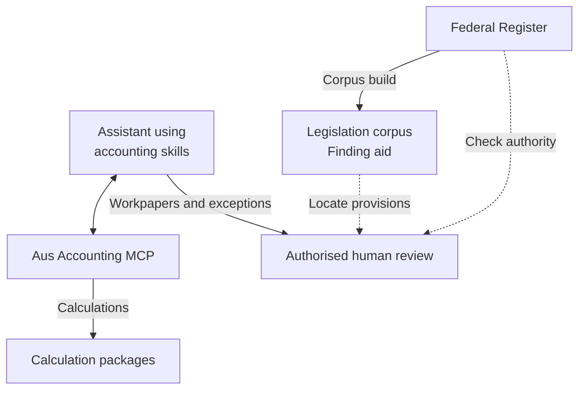
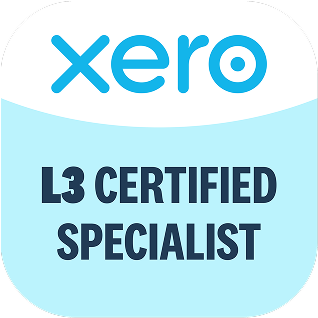

# Ryan Duguid

I'm a Senior Accountant in Newcastle, Australia. I build open-source tools for cash-flow modelling, month-end review and Australian tax and payroll calculations.

[Website](https://duguid.com.au/) · [Worked examples](https://duguid.com.au/evaluate/) · [Credentials and evidence](https://duguid.com.au/evidence/)

Start with the [fictional Newcastle cash-flow case](https://duguid.com.au/examples/profit-vs-cash-flow/): how a quarter can show $35,957.55 of profit while the bank account runs $25,160 short, with the Excel forecast, the working and a management briefing.

 
   
  

## Selected work

- **[au-fpa-pack](https://github.com/ryanduguid/au-fpa-pack):** Australian cash-flow forecasts and management briefings using fictional businesses. Extends Guiderail's [openfpa](https://github.com/JeffBrines/openfpa). [Read the worked example](https://duguid.com.au/examples/profit-vs-cash-flow/).
- **[Accounting Review Pipeline](https://github.com/ryanduguid/accounting-review-pipeline):** Xero exports, month-end exceptions and workpaper review packs, with Excel and Power BI components.
- **[Ozzit](https://github.com/ryanduguid/Ozzit):** 133 native Excel LAMBDA functions plus 5 help tables for financial modelling and GST arithmetic, with editable examples. No macros or add-ins; needs Microsoft 365 or Excel 2024 and later. [What it covers and what it needs](https://duguid.com.au/tools/ozzit/).
- **[Australian Accounting](https://github.com/ryanduguid/australian-accounting):** Tax and payroll calculation packages, plus a local Model Context Protocol (MCP) server for supported tools. Install it with `uvx aus-accounting-mcp`.
- **[Australian Accounting Skills](https://github.com/ryanduguid/australian-accounting-skills):** AI-assisted preparation workflows for public practice and subcontractor accounting: 19 in release v0.2.1 and 50 on the default branch preparing v0.3.0.
- **[llm-tax-guardrails](https://github.com/ryanduguid/llm-tax-guardrails):** APES 110 and TPB Code controls, refusal patterns and evaluation fixtures for firms using LLMs in tax work. Conclusions stay with the registered practitioner.

[Browse the tools](https://duguid.com.au/tools/) or [reproduce the public evaluations](https://duguid.com.au/evaluate/). Public examples use fabricated data; the forecasting example's [independent accountant trial](https://duguid.com.au/evaluate/) remains pending.

These are preparation and review aids. They do not lodge or write to ledgers; professional judgement and sign-off stay with the reviewer.

How the accounting tools fit together

Skills guide preparation. A configured assistant can call the local MCP server,
which delegates calculations to independently released packages. Workpapers and
unresolved exceptions go to an authorised human for review.

The [corpus](https://github.com/ryanduguid/au-tax-legislation-corpus) is a separate
finding aid derived from the Register's EPUB reading view. It is not authorised
legislation or an automatic source feed into the calculation engines. Dashed
arrows show reference use, which still requires checking the applicable authority.

Inspect the [local MCP server](https://github.com/ryanduguid/australian-accounting/tree/main/apps/aus-accounting-mcp), its [PyPI distribution](https://pypi.org/project/aus-accounting-mcp/) and its [MCP Registry listing](https://registry.modelcontextprotocol.io/v0.1/servers/io.github.ryanduguid%2Faus-accounting/versions/latest).

## Background

- Provisional member of Chartered Accountants ANZ
- SAP S/4HANA certified in [Financial Accounting (FI)](https://www.credly.com/badges/750e7557-ab6d-4b28-a241-8252c263613a/public_url) and [Management Accounting (CO)](https://www.credly.com/badges/0f753c71-5f49-41be-8519-51e81030a8f1/public_url)
- Xero Certified Specialist, Level 3, awarded 1 July 2026 and valid until 1 July 2027

 Read the <a href="https://duguid.com.au/evidence/#xero-certification">certificate in the evidence register</a>, or explore my <a href="https://duguid.com.au/tools/xero-trial-balance/">Xero trial balance export and review workflow</a>.

The badge is Xero's artwork, taken from that certificate. Xero has not endorsed or certified anything here.

## Contributions

Across 17 upstream projects I have [52 merged pull requests](https://github.com/search?q=is%3Apr+author%3Aryanduguid+is%3Amerged+merged%3A%3C%3D2026-09-20+-user%3Aryanduguid&type=pullrequests) as at 20 September 2026, 34 of them in [OpenAccountants](https://github.com/OpenAccountants/openaccountants/pulls?q=is%3Apr+author%3Aryanduguid+is%3Amerged+merged%3A%3C%3D2026-09-20). Two examples:

- **Meltano SDK:** I fixed OAuth refresh-token handling so the authenticator keeps a replacement token and preserves the existing token when no replacement arrives. The change includes regression tests and updates the in-memory authenticator. Persistent configuration write-back is outside its scope. [Merged 8 August 2026](https://github.com/meltano/sdk/pull/3727).
- **OpenAccountants:** I restored Australian BAS guide corrections after an older platform export overwrote them, and added checks for stale source changes. The repository checks detect this overwrite pattern. Preventing it also requires changes to the private exporter. [Merged 11 August 2026](https://github.com/OpenAccountants/openaccountants/pull/85).

[FORKS.md](FORKS.md) lists the contribution forks and the upstream pull requests they back.

## Setup

OpenHands runs on my old uni laptop with [CachyOS](https://cachyos.org/), unattended, so its commit timestamps show when a job finished rather than when I was at a keyboard. I use Hermes Agent on my [Windows 11 IoT Enterprise LTSC](https://www.microsoft.com/en-us/evalcenter/evaluate-windows-11-iot-enterprise-ltsc) desktop and supplement my vitamin D. Both machines are my own and everything here is built in my own time.