# Ryan Duguid

Australian accountant based in Newcastle, NSW. I build open-source tools, Excel LAMBDA libraries, and deterministic AI agent workflows for Australian accounting, tax, payroll, superannuation, and financial modeling.

> Provisional Member CA ANZ &bull; SAP S/4HANA Certified in FI and CO &bull; Xero Advisor L3

---

## 🏛️ The Australian Computational Accounting Stack

```mermaid
flowchart LR
    subgraph Data ["1. Data & Ledgers"]
        direction TB
        Xero["JohnSpenceOgilvy<br/><i>Xero Trial Balance Export</i>"]
        PQ["SirAlexanderFitzgerald<br/><i>Power Query & VBA</i>"]
    end

    subgraph Engines ["2. Rules & Computational Engines"]
        direction TB
        Ozzit["Ozzit<br/><i>130 Native Excel LAMBDAs</i>"]
        Nixon["EdwinNixon<br/><i>Company Tax & Franking FAB</i>"]
        Goldberg["LouisGoldberg<br/><i>Trust Div 6 & s100A Matrix</i>"]
        ATO["RaymondChambers<br/><i>ATO Benchmark Comparison</i>"]
        Super["payday-super-checker<br/><i>Payday Super & SG Charge</i>"]
    end

    subgraph AI ["3. Agent Workflows & Safety Boundaries"]
        direction TB
        MCP["aus-accounting-mcp<br/><i>Unified MCP Agent Server</i>"]
        MAH["MaryAddisonHamilton<br/><i>Claude Code Practice Skills</i>"]
        SubSkills["subcontractor-accounting-skills<br/><i>Construction & Mining Skills</i>"]
        DrD["DrDebits<br/><i>Tax Ethics & LLM Guidance</i>"]
        Gateway["xero-ai-review-gateway<br/><i>Synthetic Data Safety Gate</i>"]
    end

    Data --> Engines --> AI
```

---

## 📦 Selected Projects

### Unified Agent Infrastructure & MCP
- **[aus-accounting-mcp](https://github.com/ryanduguid/aus-accounting-mcp)** — Unified Model Context Protocol (MCP) server exposing ATO benchmarks, Payday Super 2026 stress simulations, Division 7A amortisation, and synthetic SBR test payloads to Claude Desktop, Claude Code, Cursor, and Antigravity.

### Computational Engines & Rules
- **[Ozzit](https://github.com/ryanduguid/Ozzit)** — Library of 130 native Excel `LAMBDA` functions for dynamic-array financial models, loan amortization, tax depreciation, and cash flow forecasting with no VBA or add-ins.
- **[EdwinNixon](https://github.com/ryanduguid/EdwinNixon)** *(Corporate Tax & Franking)* — Corporate tax rate verification (Base Rate Entity test under *s 23AA ITRA 1986*), Franking Account Balance (FAB) ledger tracking, Division 203 benchmark rule compliance, and dividend distribution statements.
- **[LouisGoldberg](https://github.com/ryanduguid/LouisGoldberg)** *(Trust Income & Section 100A)* — Trust income allocation under Division 6 ITAA 1936 (*Bamford v FCT* proportionate approach), Section 100A reimbursement agreement risk assessment (*ATO PCG 2022/2*), and Section 99B foreign trust receipt analysis.
- **[payday-super-checker](https://github.com/ryanduguid/payday-super-checker)** — Automated CLI tool for evaluating Australian payday-super contribution timelines, statutory due dates, and estimating potential Superannuation Guarantee (SG) charge exposure.
- **[RaymondChambers](https://github.com/ryanduguid/RaymondChambers)** *(ATO Benchmark Compare)* — Local, offline profit-and-loss variance analysis against Australian Taxation Office (ATO) small business benchmarks with full audit trail working.

### Ledger Connectors & Controls
- **[JohnSpenceOgilvy](https://github.com/ryanduguid/JohnSpenceOgilvy)** *(Xero Trial Balance Export)* — Exports Xero trial balances to validated CSV for Power BI, Excel, and pandas only after movement and year-to-date balances reconcile.
- **[SirAlexanderFitzgerald](https://github.com/ryanduguid/SirAlexanderFitzgerald)** — Power Query and VBA utilities for Australian accounting and reporting workflows.
- **[monthly-close-control-plane](https://github.com/ryanduguid/monthly-close-control-plane)** — Review-first controls for trial balance exports with deterministic period locking.

### AI Agent Workflows & Deterministic Safety
- **[MaryAddisonHamilton](https://github.com/ryanduguid/MaryAddisonHamilton)** *(Australian Accounting Skills for Claude Code)* — 9 skills for Australian public practice workflows (BAS reconciliation, FBT, Division 7A loan agreements, STP Phase 2, and 13-week cashflows).
- **[subcontractor-accounting-skills](https://github.com/ryanduguid/subcontractor-accounting-skills)** — Claude Code skills for Australian construction & mining subcontractors (progress claims, retentions, WIP, Coal LSL, and contractor payroll tax).
- **[DrDebits](https://github.com/ryanduguid/DrDebits)** — Versioned, primary-source-linked ethical and operational instructions for LLM-assisted Australian accounting and tax work.
- **[xero-ai-review-gateway](https://github.com/ryanduguid/xero-ai-review-gateway)** — Fixed-policy, zero-network safety boundary for AI-assisted trial balance review using synthetic test data.

### Curated Indexes
- **[awesome-australian-accounting-tech](https://github.com/ryanduguid/awesome-australian-accounting-tech)** — A curated index of open-source libraries, ATO datasets, legislation APIs, and standards for Australian accounting technology.

---

## 🤝 Open-Source Contributions

Selected merged contributions across the data and finance ecosystem:
- **[Meltano SDK #3727](https://github.com/meltano/sdk/pull/3727)** — Retain OAuth refresh tokens returned by token refresh endpoints.
- **[tap-xero #20](https://github.com/Matatika/tap-xero/pull/20)** — Correction of OAuth 2.0 configuration examples and schemas.
- **[OpenAccountants](https://github.com/openaccountants/openaccountants/pulls?q=is%3Apr+author%3Aryanduguid+is%3Amerged)** — Australian tax guidance, testing harnesses, and CI automation for AI agent tax guides.
- **[Sophia Script for Windows #737](https://github.com/farag2/Sophia-Script-for-Windows/pull/737)** — Localisation and language architecture fixes.

---

## 📐 Working Method & Safety Boundary

1. **Primary Source Grounding**: All statutory calculations (tax brackets, SG percentages, benchmark ratios, penalty rates) are verified directly against primary legislation, ATO rulings, and AASB/IFRS accounting standards.
2. **Deterministic Reconciliation**: Computational outputs must strictly reconcile to inputs before downstream consumption. Exception handling is surfaced transparently.
3. **Privacy & Synthetic Data by Design**: Public repositories strictly run against non-client synthetic data. AI boundaries isolate client ledgers from non-deterministic external LLM calls.
4. **Professional Judgement**: Software handles validation and calculation; ultimate interpretation, professional judgement, and consequential lodgments remain with appropriately qualified practitioners.