# Ryan Duguid

Australian accountant based in Newcastle, NSW. Specialising in computational accounting, deterministic reconciliation engines, native Excel LAMBDA architectures, and structured AI agent workflows across Australian taxation, payroll, and statutory superannuation.

> Provisional Member CA ANZ &bull; SAP S/4HANA Certified in FI and CO &bull; Xero Advisor L3

---

## 🏛️ The Australian Computational Accounting Stack

```mermaid
flowchart LR
    subgraph Data ["1. Data & Ledgers"]
        direction TB
        Xero["JohnSpenceOgilvy<br/><i>Validated Trial Balance Export</i>"]
        PQ["SirAlexanderFitzgerald<br/><i>Power Query & VBA</i>"]
    end

    subgraph Engines ["2. Rules & Computational Engines"]
        direction TB
        Ozzit["Ozzit<br/><i>130 Native Excel LAMBDAs</i>"]
        Nixon["EdwinNixon<br/><i>Company Tax & Franking FAB</i>"]
        Goldberg["LouisGoldberg<br/><i>Trust Div 6 & s100A Matrix</i>"]
        ATO["RaymondChambers<br/><i>ATO Benchmark Analysis</i>"]
        Super["payday-super-checker<br/><i>Payday Super & SG Charge</i>"]
    end

    subgraph AI ["3. Agent Workflows & Safety Boundaries"]
        direction TB
        MCP["aus-accounting-mcp<br/><i>Unified MCP Agent Server</i>"]
        MAH["MaryAddisonHamilton<br/><i>Public-Practice Workflow Skills</i>"]
        SubSkills["Hardhat Ledger<br/><i>Construction & Mining Skills</i>"]
        DrD["DrDebits<br/><i>Tax Ethics & LLM Guidance</i>"]
        Gateway["ElizabethAnneAlexander<br/><i>Synthetic Data Safety Perimeter</i>"]
    end

    Data --> Engines --> AI
```

---

## 📦 Selected Projects

### Unified Agent Infrastructure & MCP
- **[aus-accounting-mcp](https://github.com/ryanduguid/aus-accounting-mcp)** - Unified Model Context Protocol (MCP) server exposing ATO small business benchmarks, Payday Super 2026 stress simulations, Division 7A amortisation schedules, and synthetic SBR validation payloads to Claude Desktop, Claude Code, Cursor, and Antigravity.

### Computational Engines & Rules
- **[Ozzit](https://github.com/ryanduguid/Ozzit)** - Comprehensive suite of 130 native Excel `LAMBDA` functions for dynamic-array financial modelling, loan amortisation, capital allowance depreciation, and deterministic cash flow forecasting without VBA or external dependencies.
- **[EdwinNixon](https://github.com/ryanduguid/EdwinNixon)** *(Corporate Tax & Franking)* - Corporate tax rate determination (Base Rate Entity eligibility under *s 23AA ITRA 1986*), Franking Account Balance (FAB) ledger tracking, Division 203 benchmark rule compliance, and automated dividend distribution statements.
- **[LouisGoldberg](https://github.com/ryanduguid/LouisGoldberg)** *(Trust Income & Section 100A)* - Trust income allocation under Division 6 ITAA 1936 (*Bamford v FCT* proportionate approach), Section 100A reimbursement agreement risk classification (*ATO PCG 2022/2*), and Section 99B foreign trust receipt analysis.
- **[payday-super-checker](https://github.com/ryanduguid/payday-super-checker)** - Deterministic CLI utility evaluating Australian Payday Super contribution timelines, statutory due dates, and estimating Superannuation Guarantee (SG) charge exposure on late remittances.
- **[RaymondChambers](https://github.com/ryanduguid/RaymondChambers)** *(`ato-benchmark-compare` package)* - Localised, offline profit-and-loss variance analysis against Australian Taxation Office (ATO) small business benchmarks with comprehensive, auditable working papers.

### Ledger Connectors & Controls
- **[JohnSpenceOgilvy](https://github.com/ryanduguid/JohnSpenceOgilvy)** *(`xero-trial-balance-export` package)* - Exports reconciled Xero trial balances to validated CSV formats for Power BI, Excel, and pandas, enforcing strict movement and year-to-date mathematical integrity.
- **[SirAlexanderFitzgerald](https://github.com/ryanduguid/SirAlexanderFitzgerald)** - Power Query (M) and VBA automation utilities for Australian accounting, ledger reconciliations, and structured month-end financial reporting pipelines.
- **[monthly-close-control-plane](https://github.com/ryanduguid/monthly-close-control-plane)** - Review-first governance controls for trial balance exports featuring deterministic period locking and exception surfacing.

### AI Agent Workflows & Deterministic Safety
- **[MaryAddisonHamilton](https://github.com/ryanduguid/MaryAddisonHamilton)** *(`australian-accounting-skills` plugin pack)* - Nine modular agent skills for Australian public practice (BAS reconciliation, FBT, Division 7A statutory benchmark compliance, STP Phase 2, and 13-week cash flow modelling).
- **[Hardhat Ledger](https://github.com/ryanduguid/hardhat-ledger)** - Claude Code skills tailored for Australian construction and mining subcontractors (payment claims under Security of Payment acts, retention tracking, WIP billing, Coal LSL, and contractor payroll tax provisions).
- **[DrDebits](https://github.com/ryanduguid/DrDebits)** - Versioned, primary-source-grounded ethical and operational boundaries (aligned with APES 110 and TPB Code of Professional Conduct) for LLM-assisted taxation workflows.
- **[ElizabethAnneAlexander](https://github.com/ryanduguid/ElizabethAnneAlexander)** - Fixed-policy, zero-network security perimeter for AI-assisted trial balance review utilising synthetic test datasets.

### Curated Indexes
- **[awesome-australian-accounting-tech](https://github.com/ryanduguid/awesome-australian-accounting-tech)** - A curated index of open-source libraries, computational accounting engines, ATO datasets, Commonwealth legislation APIs, and professional standards.

---

## 📊 Ecosystem Index & Statutory Matrix

| Package / Repository | Domain & Statutory Reference | Interface / Runtime | Target Application |
| :--- | :--- | :--- | :--- |
| **[`aus-accounting-mcp`](https://github.com/ryanduguid/aus-accounting-mcp)** | ATO Benchmarks, *SGAA 1992*, *Div 7A ITAA 1936* | MCP Server (JSON-RPC) | Claude Code, Cursor, Antigravity |
| **[`Ozzit`](https://github.com/ryanduguid/Ozzit)** | Financial Modelling, Loan Amortisation, Tax Depr. | Native Excel Dynamic Arrays | Financial Models & Workpapers |
| **[`EdwinNixon`](https://github.com/ryanduguid/EdwinNixon)** | *s 23AA ITRA 1986*, *Div 203 ITAA 1997* (FAB) | Python CLI & Library | Corporate Tax Returns & FAB Tracking |
| **[`LouisGoldberg`](https://github.com/ryanduguid/LouisGoldberg)** | *Div 6*, *s 100A*, *s 99B ITAA 1936* | Python CLI & Library | Trust Distribution Determinations |
| **[`payday-super-checker`](https://github.com/ryanduguid/payday-super-checker)** | Payday Super 2026, *SGAA 1992* (SGC) | Python CLI | Employer Payroll Timeline Audits |
| **[`RaymondChambers`](https://github.com/ryanduguid/RaymondChambers)** | ATO Small Business Benchmarks | Python (`ato-benchmark-compare`) | Local P&L Variance Analysis |
| **[`JohnSpenceOgilvy`](https://github.com/ryanduguid/JohnSpenceOgilvy)** | Xero OAuth 2.0 API, General Ledger | Python (`xero-trial-balance-export`) | Reconciled CSV Extraction |
| **[`MaryAddisonHamilton`](https://github.com/ryanduguid/MaryAddisonHamilton)** | BAS, FBT, Div 7A, STP Phase 2 | Claude Code Skills Plugin | Practice Workflow Automation |
| **[`DrDebits`](https://github.com/ryanduguid/DrDebits)** | *APES 110*, *TASA 2009* Code of Conduct | System Prompt & Boundary Specs | AI Tax Practice Governance |

---

## 🤝 Open-Source Contributions

Selected merged contributions across the data and finance ecosystem:
- **[Meltano SDK #3727](https://github.com/meltano/sdk/pull/3727)** - Preservation of OAuth refresh tokens returned by token refresh endpoints.
- **[tap-xero #20](https://github.com/Matatika/tap-xero/pull/20)** - Rectification of OAuth 2.0 configuration specifications and schema definitions.
- **[OpenAccountants](https://github.com/openaccountants/openaccountants/pulls?q=is%3Apr+author%3Aryanduguid+is%3Amerged)** - Australian taxation guidance, validation test harnesses, and CI automation for AI agent tax guides.
- **[Sophia Script for Windows #737](https://github.com/farag2/Sophia-Script-for-Windows/pull/737)** - Localisation and language architecture enhancements.

---

## 📐 Working Method & Safety Boundary

1. **Primary Source Grounding**: All statutory computations (marginal tax brackets, SG percentages, benchmark ratios, penalty rates) are grounded directly in Commonwealth primary legislation, ATO public rulings, and AASB/IFRS accounting standards.
2. **Deterministic Reconciliation**: Computational outputs must mathematically reconcile to underlying source ledgers before downstream consumption. Invariants and reconciliation exceptions are surfaced explicitly.
3. **Privacy & Synthetic Data by Design**: Public repositories execute exclusively against sanitised, synthetic data structures. Architectural boundaries isolate confidential client ledgers from non-deterministic external LLM invocations.
4. **Professional Judgement**: Algorithmic pipelines automate calculation and structural validation; ultimate interpretation, professional judgement, and statutory lodgements remain strictly within the purview of qualified practitioners.
