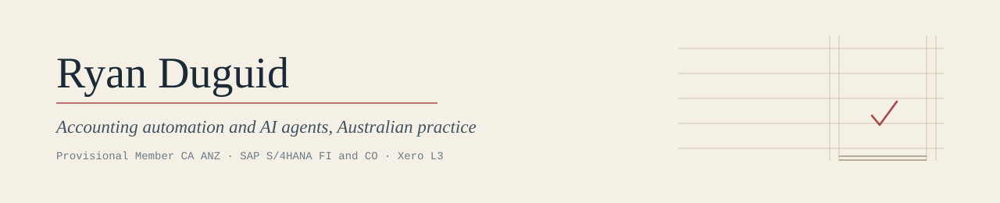

I write my original projects in my own time, on my own equipment, using synthetic or non-client data.
Some repositories on this account are forks used for upstream contributions; those forks retain the
upstream projects' authorship and licence histories. No client data is committed.

Provisional Member CA ANZ &#183; SAP S/4HANA certified in FI and CO &#183; Xero L3

## Tools

| Repository | What it does |
| --- | --- |
| [payday-super-checker](https://github.com/ryanduguid/payday-super-checker) | Reads a payroll CSV, checks fund receipt against the ordinary seven-business-day period and supported allowable longer periods, and produces an experimental SG-charge estimate where the supplied facts establish lateness. It does not determine an employer's legal liability or the ATO's assessment. |
| [xero-trial-balance-export](https://github.com/ryanduguid/xero-trial-balance-export) | One command, one balanced CSV. It refuses to write the file when debits do not equal credits. |
| [australian-accounting-skills](https://github.com/ryanduguid/australian-accounting-skills) | Nine agent skills: BAS, FBT, Division 7A, STP, month-end close, workpaper tie-outs. |
| [subcontractor-accounting-skills](https://github.com/ryanduguid/subcontractor-accounting-skills) | The same idea for contracting and mining services. Progress claims, retentions, WIP, fuel tax credits, Coal LSL, the contractor limbs of payroll tax. |
| [accounting-excel-toolkit](https://github.com/ryanduguid/accounting-excel-toolkit) | Power Query and VBA that live as text in git, not buried inside a workbook nobody can diff. |
| [Ozzit](https://github.com/ryanduguid/Ozzit) | 130 LAMBDA functions in one workbook for dynamic-array financial models. Built from native Excel functions only, so what you assemble with it saves as an ordinary .xlsx with no add-ins and no macros. |
| [ato-benchmark-compare](https://github.com/ryanduguid/ato-benchmark-compare) | Scores a profit and loss against the ATO small business benchmarks on your own machine, and shows the working. |
| [monthly-close-control-plane](https://github.com/ryanduguid/monthly-close-control-plane) | Builds the exception pack a close review actually needs. It writes no journals and locks no periods. |
| [au-tax-legislation-corpus](https://github.com/ryanduguid/au-tax-legislation-corpus) | A reproducible build of in-force Commonwealth tax legislation for retrieval, with the provenance kept next to the text. |
| [au-tax-change-impact-monitor](https://github.com/ryanduguid/au-tax-change-impact-monitor) | A review queue for possible changes to tax sources. It matches identifiers and leaves the judgement to a person. |
| [xero-ai-review-gateway](https://github.com/ryanduguid/xero-ai-review-gateway) | A boundary experiment on synthetic data: what an AI reviewer may see, and what it may never touch. |
| [DrDebits](https://github.com/ryanduguid/DrDebits) | Versioned, source-linked ethics instructions for tax practitioners working with LLMs. |
| [release-policy](https://github.com/ryanduguid/release-policy) | The reusable release workflow behind the tags in these repositories. Fail-closed gates, SBOM, build provenance. |

## Merged into other people's projects

Nine changes so far, most of them small, which is rather the point.
[meltano/sdk#3727](https://github.com/meltano/sdk/pull/3727) keeps a rotated
OAuth refresh token instead of throwing it away.
[Matatika/tap-xero#20](https://github.com/Matatika/tap-xero/pull/20) corrects
configuration examples that could not have worked. Seven at
[openaccountants](https://github.com/openaccountants/openaccountants/pulls?q=is%3Apr+author%3Aryanduguid+is%3Amerged):
the Australian super, FBT, Division 7A and GST guides
([#77](https://github.com/openaccountants/openaccountants/pull/77),
[#78](https://github.com/openaccountants/openaccountants/pull/78),
[#79](https://github.com/openaccountants/openaccountants/pull/79),
[#84](https://github.com/openaccountants/openaccountants/pull/84)); restoring a
guide a website sync had overwritten, with a CI check so the same loss
fails the build next time
([#85](https://github.com/openaccountants/openaccountants/pull/85)); binding the
MCP transport to loopback
([#89](https://github.com/openaccountants/openaccountants/pull/89)); and dropping
a licence classifier that broke the package build
([#90](https://github.com/openaccountants/openaccountants/pull/90)).

## How this is written

Rates, dates and section numbers get checked against the primary source. 
Outputs reconcile back to what they came from and surface whatever does not tie. 
The tools prepare evidence and surface exceptions. A suitably authorised person remains responsible for professional judgement and any consequential action.
