# Ryan Duguid

[](https://www.python.org/)
[](https://github.com/ryanduguid/JohnKenley)
[](https://github.com/ryanduguid/Ozzit)
[](https://github.com/ryanduguid/MaryAddisonHamilton)
[](https://developer.xero.com/)
[](llms.txt)
[](https://www.charteredaccountantsanz.com/)

Australian accountant based in Newcastle, NSW. Specialising in computational accounting, deterministic reconciliation engines, native Excel LAMBDA architectures, and structured AI agent workflows across Australian taxation, payroll, and statutory superannuation.

> Provisional member of Chartered Accountants ANZ &bull; SAP S/4HANA Certified in FI and CO &bull; Xero Advisor L3

---

## Install these two

### [MaryAddisonHamilton](https://github.com/ryanduguid/MaryAddisonHamilton)

Nine public-practice workflow skills (BAS tie-out, FBT, Division 7A, STP, workpapers). Prep-only. Not lodgment.

```
/plugin marketplace add ryanduguid/MaryAddisonHamilton
/plugin install australian-accounting-skills@ryanduguid
```

```bash
npx skills add ryanduguid/MaryAddisonHamilton
```

### [JohnKenley](https://github.com/ryanduguid/JohnKenley)

Local MCP server for ATO small-business benchmarks, Payday Super 2026 review, refused Division 7A, and synthetic SBR fixtures.

```bash
uvx --from git+https://github.com/ryanduguid/JohnKenley aus-accounting-mcp
```

```json
{
  "mcpServers": {
    "aus-accounting": {
      "command": "uvx",
      "args": [
        "--from",
        "git+https://github.com/ryanduguid/JohnKenley",
        "aus-accounting-mcp"
      ]
    }
  }
}
```

---

## Featured (pinned)

These six originals are pinned on the profile so the overview is engines and skills, not SDK or Windows forks.

1. **[CharlesHenryWickens](https://github.com/ryanduguid/CharlesHenryWickens)** - Payday Super timelines and SG charge exposure.
2. **[Ozzit](https://github.com/ryanduguid/Ozzit)** - 130 native Excel LAMBDAs for AU financial modelling.
3. **[JohnSpenceOgilvy](https://github.com/ryanduguid/JohnSpenceOgilvy)** - Reconciled Xero trial balance export.
4. **[MaryAddisonHamilton](https://github.com/ryanduguid/MaryAddisonHamilton)** - Claude Code skills for Australian public practice.
5. **[RaymondChambers](https://github.com/ryanduguid/RaymondChambers)** - Local P&L vs ATO small business benchmarks.
6. **[DrDebits](https://github.com/ryanduguid/DrDebits)** - APES 110 / TPB operating boundaries for LLM tax work.

---

## The stack those products sit on

```mermaid
flowchart LR
    subgraph Data ["1. Data and ledgers"]
        direction TB
        Xero["JohnSpenceOgilvy<br/><i>Validated trial balance export</i>"]
        PQ["SirAlexanderFitzgerald<br/><i>Power Query and VBA</i>"]
    end

    subgraph Engines ["2. Rules and engines"]
        direction TB
        Ozzit["Ozzit<br/><i>130 native Excel LAMBDAs</i>"]
        Nixon["TheExchequerTally<br/><i>Company tax and franking FAB</i>"]
        Goldberg["SolomonsSword<br/><i>Trust Div 6 and s100A</i>"]
        ATO["RaymondChambers<br/><i>ATO benchmark analysis</i>"]
        Super["CharlesHenryWickens<br/><i>Payday Super and SG charge</i>"]
    end

    subgraph AI ["3. Agent workflows"]
        direction TB
        MCP["JohnKenley<br/><i>Unified MCP server</i>"]
        MAH["MaryAddisonHamilton<br/><i>Public-practice skills</i>"]
        SubSkills["Hardhat Ledger<br/><i>Construction and mining</i>"]
        DrD["DrDebits<br/><i>Tax ethics and LLM guidance</i>"]
        Gateway["ElizabethAnneAlexander<br/><i>Synthetic review boundary</i>"]
    end

    Data --> Engines --> AI
```



JohnKenley calls CharlesHenryWickens and RaymondChambers (`ato-benchmark-compare`). MaryAddisonHamilton names those CLIs rather than inventing the same work. Historical engine repositories stay the source of truth for the calculation; the two products above are what a stranger should install.

### Engines behind the MCP

- **[CharlesHenryWickens](https://github.com/ryanduguid/CharlesHenryWickens)** - Payday Super timelines and experimental SG-charge exposure. Not an ATO assessment.
- **[RaymondChambers](https://github.com/ryanduguid/RaymondChambers)** (`ato-benchmark-compare`) - Offline P&L variance against ATO small-business benchmarks.
- **[Ozzit](https://github.com/ryanduguid/Ozzit)** - 130 native Excel `LAMBDA` functions; no VBA, no add-ins.
- **[TheExchequerTally](https://github.com/ryanduguid/TheExchequerTally)** - Base Rate Entity rate, franking account balance, Division 203.
- **[SolomonsSword](https://github.com/ryanduguid/SolomonsSword)** - Trust Division 6, s 100A, s 99B.
- **[JohnSpenceOgilvy](https://github.com/ryanduguid/JohnSpenceOgilvy)** (`xero-trial-balance-export`) - Reconciled Xero trial balance CSV; movement and YTD must both tie before write.

### Also

- **[Hardhat Ledger](https://github.com/ryanduguid/hardhat-ledger)** - Construction and mining skills (Security of Payment, retentions, Coal LSL).
- **[DrDebits](https://github.com/ryanduguid/DrDebits)** - APES 110 and TPB-aligned operating boundaries for LLM tax work.
- **[ElizabethAnneAlexander](https://github.com/ryanduguid/ElizabethAnneAlexander)** - Synthetic-data demonstration of a fixed-policy review boundary.
- **[RussellMathews](https://github.com/ryanduguid/RussellMathews)** - Local trial-balance review packs; it does not approve or lock a close.
- **[awesome-australian-accounting-tech](https://github.com/ryanduguid/awesome-australian-accounting-tech)** - Curated index of AU accounting libraries, ATO datasets, and legislation APIs.

---

## Open-source contributions

Selected merged contributions across the data and finance ecosystem:
- **[Meltano SDK #3727](https://github.com/meltano/sdk/pull/3727)** - Preservation of OAuth refresh tokens returned by token refresh endpoints.
- **[tap-xero #20](https://github.com/Matatika/tap-xero/pull/20)** - Rectification of OAuth 2.0 configuration specifications and schema definitions.
- **[OpenAccountants](https://github.com/openaccountants/openaccountants/pulls?q=is%3Apr+author%3Aryanduguid+is%3Amerged)** - Australian taxation guidance, validation test harnesses, and CI automation for AI agent tax guides.
- **[Sophia Script for Windows #737](https://github.com/farag2/Sophia-Script-for-Windows/pull/737)** - Localisation and language architecture enhancements.

---

## Working method and safety boundary

1. **Primary source grounding**: Statutory computations are grounded in Commonwealth legislation, ATO public rulings, and AASB/IFRS. Mutable facts are verified at use time.
2. **Deterministic reconciliation**: Outputs must mathematically reconcile to source ledgers. Exceptions are surfaced, not smoothed.
3. **Synthetic public evidence**: Public fixtures are fabricated. Client data stays local and human-controlled.
4. **Professional judgement**: Algorithms calculate and validate. Interpretation, lodgement, and sign-off stay with qualified practitioners.
