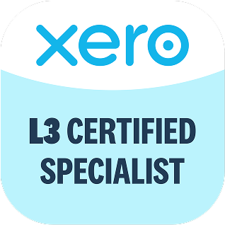
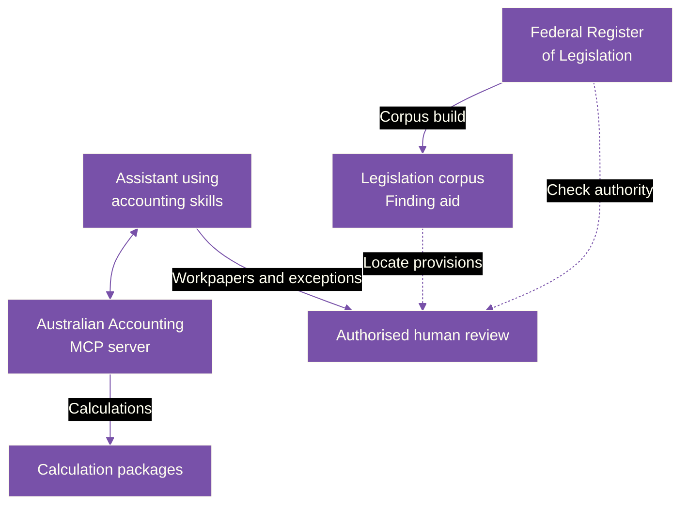

# Ryan Duguid

I am a Senior Accountant in Newcastle, Australia. I build open source tools for cash-flow modelling, month-end review and Australian tax and payroll calculations.

[Website](https://duguid.com.au/) · [Tools](https://duguid.com.au/tools/) · [Evaluations](https://duguid.com.au/evaluate/) · [Credentials and evidence](https://duguid.com.au/evidence/)

This is a free software portfolio. I am not a registered tax agent or BAS agent.

## Try an accounting task

| Your task | Example and expected result | What you need |
| --- | --- | --- |
| Explain profit and cash differences | [Fictional Newcastle cash-flow case](https://duguid.com.au/examples/profit-vs-cash-flow/): $35,957.55 quarterly profit and a $25,160 cash shortfall | Read in your browser; desktop Excel to change the receipt delay |
| Calculate in Excel | [Ozzit formula and workbook](https://duguid.com.au/tools/ozzit/#worked-example): extract $100 GST from a wholly taxable $1,100 amount | Microsoft 365 or Excel 2024 or later |
| Review a month-end close | [Monthly Close Controls](https://duguid.com.au/tools/monthly-close-controls/#worked-example): eight exceptions, including a $250 creditors difference | Read in your browser; Git and Python 3.10 or later to reproduce the pack |

Each example includes its workings, version and review boundary.

## Background

- Provisional member of Chartered Accountants ANZ
- SAP S/4HANA certified in [Financial Accounting (FI)](https://www.credly.com/badges/750e7557-ab6d-4b28-a241-8252c263613a/public_url) and [Management Accounting (CO)](https://www.credly.com/badges/0f753c71-5f49-41be-8519-51e81030a8f1/public_url)
- Xero Certified Specialist, Level 3, awarded 1 July 2026 and valid until 1 July 2027

 Read the <a href="https://duguid.com.au/evidence/#xero-certification">certificate in the evidence register</a>, or explore my <a href="https://duguid.com.au/tools/xero-trial-balance/">Xero trial balance export and review workflow</a>.

The badge is Xero's artwork, taken from that certificate. Xero has not endorsed or certified anything here.

## Selected work

- **[au-fpa-pack](https://github.com/ryanduguid/au-fpa-pack):** Australian cash-flow forecasts and management briefings using fictional businesses. Extends Guiderail's [openfpa](https://github.com/JeffBrines/openfpa).
- **[Accounting Review Pipeline](https://github.com/ryanduguid/accounting-review-pipeline):** Xero exports, month-end exceptions and workpaper review packs, with Excel and Power BI components.
- **[Ozzit](https://github.com/ryanduguid/Ozzit):** 133 native Excel LAMBDA functions plus 5 help tables for financial modelling and GST arithmetic, with editable examples. No macros or add-ins; needs Microsoft 365 or Excel 2024 or later. [What it covers and what it needs](https://duguid.com.au/tools/ozzit/).
- **[Australian Accounting](https://github.com/ryanduguid/australian-accounting):** Tax and payroll calculation packages, plus a local Model Context Protocol (MCP) server for supported tools. Install it with `uvx aus-accounting-mcp`.
- **[Australian Accounting Skills](https://github.com/ryanduguid/australian-accounting-skills):** AI-assisted preparation workflows for public practice and subcontractor accounting, with validation cards and recorded model runs.
- **[llm-tax-guardrails](https://github.com/ryanduguid/llm-tax-guardrails):** APES 110 and TPB Code controls, refusal patterns and evaluation fixtures for firms using LLMs in tax work. Conclusions stay with the registered practitioner.
- **[au-tax-legislation-corpus](https://github.com/ryanduguid/au-tax-legislation-corpus):** Builds retrieval material from in-force Commonwealth tax legislation on the Federal Register of Legislation, with source and provenance records. It is a finding aid, not authorised legislation.

 

How the accounting tools fit together

Skills guide preparation. A configured assistant can call the local MCP server, which delegates calculations to independently released packages. Workpapers and unresolved exceptions go to an authorised human for review.

```mermaid
flowchart TB
%%{init: {"theme": "base", "themeVariables": {"background": "#000000", "primaryColor": "#7851A9", "primaryTextColor": "#FFFFF0", "primaryBorderColor": "#FFFFF0", "lineColor": "#7851A9", "textColor": "#FFFFF0", "edgeLabelBackground": "#000000", "clusterBkg": "#000000", "clusterBorder": "#7851A9", "titleColor": "#FFFFF0"}}}%%
    assistant["Assistant using<br/>accounting skills"] <--> mcp["Australian Accounting<br/>MCP server"]
    mcp -->|Calculations| engines["Calculation packages"]
    assistant -->|Workpapers and exceptions| reviewer["Authorised human review"]
    official["Federal Register<br/>of Legislation"] -->|Corpus build| corpus["Legislation corpus<br/>Finding aid"]
    corpus -. Locate provisions .-> reviewer
    official -. Check authority .-> reviewer
```

The corpus is not an automatic source feed into the calculation engines. Dashed arrows show reference use, which still requires checking the applicable authority.

Inspect the [local MCP server](https://github.com/ryanduguid/australian-accounting/tree/main/apps/aus-accounting-mcp), its [PyPI distribution](https://pypi.org/project/aus-accounting-mcp/) and its [MCP Registry listing](https://registry.modelcontextprotocol.io/v0.1/servers/io.github.ryanduguid%2Faus-accounting/versions/latest).

## Using these tools

Public examples use fabricated data. The tools are preparation and review aids: they do not lodge or write to ledgers, and professional judgement and sign-off stay with the reviewer. I do not accept advice, return-preparation, tax-treatment confirmation or lodgement requests here. Support covers software issues reproduced with fabricated data, so please do not send taxpayer information.

To get in touch, use the [contact page](https://duguid.com.au/contact/).
